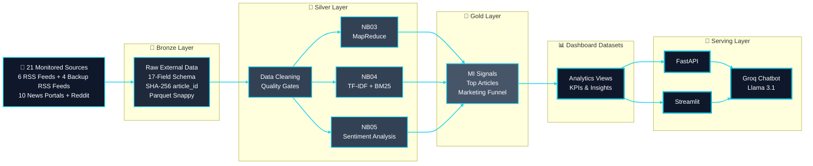

<!-- ======================================= ⚡️ Start DEFAULT HEADER ===========================================  -->
<!-- ========= START LANGUAGE BUTTON ========= -->
**\[[🇧🇷 Português](README.pt_BR.md)\] \[**[🇬🇧 English](README.md)**\]**

<br><br>
<!-- ========= END LANGUAGE BUTTON ========= -->


<!-- ========= START REPO TITLE ========= -->
# <p align="center"> [Investor Intelligence Platform  🇧🇷  Brazilian FIIs]() 

### <p align="center"> Real Estate Investment Funds (FIIs) - Market Intelligence & Behavioral Analytics

<br>

$$\Huge {\textbf{\color{green} CRISP-DM} \space \textbf{\color{white} •} \space \textbf{\color{yellow}  Data Lakehouse} \space \textbf{\color{white} •} \space \textbf{\color{green} NLP} \space \textbf{\color{white} •} \space \textbf{\color{yellow} Responsible AI} \space \textbf{\color{white} •} \space \textbf{\color{green} Regulatory Alignment}}$$

<br>

##### <p align="center"> [Big Data]() • [PySpark]() • [MapReduce Word Count]() • [NLP]() • [TF-IDF]() • [BM25 Ranking]() • [Web Scraping]() • [TOFU Strategy]() • [CRISP-DM]() • [FastAPI]() • [Streamlit]() • [Docker]() • [AI Governance]() • [LGPD Compliance]() • [Brazilian General Data Protection Law No. 13.709/2018]() • [EU AI Act Alignment]()

<br>

#### <p align="center"> ***An institutional-grade intelligence platform for monitoring, structuring, ranking, and interpreting Brazilian Real Estate Investment Fund (FII) signals from financial media, research portals, and investor communities.***

<br><br>
<!-- ========= END REPO TITLE ========= -->

<!-- ========= START SPONSOR BADGES ========= -->
### <p align="center"> [](https://github.com/sponsors/Quantum-Software-Development)
<!-- ========= END SPONSOR BADGES ========= -->

<!-- ========= START DEMO VIDEO ========= -->
<p align="center">
   

 </p>

<!--
#### 🖤 Creative Direction, Music Curation & Editing by Fab⚡️  
##### 🎶 [Soundtrack:]() "Canon in D" — Johann Pachelbel
-->

<br><br>
<!-- ========= END DEMO VIDEO ========= -->


<!-- ========= START Institutional INFO ========= -->
## 🎓 Academic 

<br>

**Institution:** Pontifical Catholic University of São Paulo (PUC-SP) — FACEI  
[**Bachelor’s Program:**]() Humanistic AI & Data Science • 5th Semester • 2026  
[**Course:**]() AI Security, Cybersecurity & Social Engineering  
**Professors** [✨ Eduardo Savino Gomes]() and [✨ Carlos Eduardo Paes](https://www.linkedin.com/in/carlos-eduardo-de-barros-paes-ph-d-7b137a4/)  
**Project Authors:** [Fabiana ⚡️ Campanari](https://linktr.ee/fabianacampanari) and [Pedro Vyctor  Almeida]()

<br><br>

#

<br><br>
<!-- ========= END Institutional INFO ========= -->


<!-- ========= START Dashboard Streamlit ========= -->
<p align="center">
  <a href="" target="_blank" rel="noopener noreferrer">
    
  </a>
</p>
<!-- ========= END Dashboard Streamlit ========= -->

<!-- ========= START REACT APP ========= -->
<p align="center">

  <a href="" target="_blank" rel="noopener noreferrer">
    
  </a>
  <!-- ========= END REACT APP ========= -->

<!-- ========= START PPTX ========= -->
  <a href="" target="_blank" rel="noopener noreferrer">
    
  </a>

</p>
<!-- ========= END PPTX ========= -->

<!-- ========= START DATA ANALYSING REPORT ========= -->
<p align="center">
  <a href="">
    
  </a>
</p>

<br><br>

#

<br><br>
<!-- ========= END DATA ANALYSING REPORT ========= -->
<!-- ===================== END BADGE GROUP 1 ===================== -->


<!-- ========= START NOTE ========= -->
> [!TIP]
> 🔗 **[Cybersecurity, Social Engineering & AI Security — Hub Repository](https://github.com/Quantum-Software-Development/1-Cybersecurity-SocialEngineering_Hub)**
>
> #
>
> ✨ Part of the **Humanistic AI, Financial Intelligence & Data Systems Series**
>
> ### [***Where market discussions become investment narratives…***]() ***because markets talk a lot... intelligent systems just listen better.*** <br>
>
> ### ⚡

<br><br>
<!-- ========= END NOTE ========= -->


<!-- ========= START !WARNING] ========= -->
> [!WARNING]
>
> <br>
> ⚠️ Projects may be publicly shared when permitted.  
> The focus is on applied, hands-on learning with real datasets in AI governance and security contexts.  
> All sensitive content remains protected in private repositories when required.  <br><br> 
> 
> ⚠️ Disclaimer
> Plataforma exclusivamente educacional e analítica. Não constitui recomendação de investimento.

<br><br>

#

<br><br>
<!-- ========= END!WARNING]========= -->


<!-- ========= START Ambient BIG DATA INSTALL ========= 
## ⚙️ Big Data Environment Setup

This section provides installation guides, infrastructure components, and learning resources for building a complete Big Data environment.

The learning path follows the same progression commonly adopted in Data Engineering and Big Data ecosystems:

```text
Operating System Setup
        ↓
Hadoop + Spark Foundation
        ↓
Docker Infrastructure
        ↓
Data Lake (MinIO)
        ↓
Distributed Data Processing (PySpark)
```

### [Hadoop Documentation]()

- [Hadoop Single Node Cluster Setup](https://hadoop.apache.org/docs/stable/hadoop-project-dist/hadoop-common/SingleCluster.html)
  - Local Hadoop cluster with HDFS, YARN, and MapReduce services running on a single machine.

- [Hadoop Multi-Node Cluster Setup](https://hadoop.apache.org/docs/current/hadoop-project-dist/hadoop-common/ClusterSetup.html)
  - Distributed Hadoop cluster deployment across multiple nodes for scalability and fault tolerance.

<br>

### [Environment Installation Guides]()

#### ***Operating System Setup***

- [Apache Hadoop & Spark Installation Guide on Ubuntu Linux](https://github.com/Quantum-Software-Development/5-cybersecurity-social-engineering-fii-marketing-intelligence-platform/blob/5b7cc5f94b67611f236bd8a06f9bcdec53f93a9b/BigData_Stack_install_Ubuntu_Mac_Windows.md/ubuntu-linux-big-data-stack-installation-guide.md)
  - Installs OpenJDK, Hadoop, HDFS, YARN, Spark, and optional mrjob support on Ubuntu Linux.

<br>

- [Apache Hadoop & Spark Installation Guide on macOS](https://github.com/Quantum-Software-Development/5-cybersecurity-social-engineering-fii-marketing-intelligence-platform/blob/2d0cf97c23cadd2b02f004d6e678abbf50cb8181/BigData_Stack_install_Ubuntu_Mac_Windows.md/macos-big-data-stack-installation-guide.md)
  - Installs OpenJDK, Hadoop, HDFS, YARN, Spark, and optional mrjob support on macOS.

- [Apache Hadoop & Spark Installation Guide on Windows](https://github.com/Quantum-Software-Development/5-cybersecurity-social-engineering-fii-marketing-intelligence-platform/blob/36fca674eed9fe1934f9f2c2f4fdcd66c209e597/BigData_Stack_install_Ubuntu_Mac_Windows.md/windows-big-data-stack-installation-guide.md)
  - Prepares a Windows environment for Apache Spark, Hadoop client dependencies, and Big Data experimentation. <br>

  > ###### [***Note:***]() ⚠️ Apache Hadoop is not officially supported on modern Windows releases. This guide provides a learning-oriented setup suitable for Apache Spark, Hadoop client libraries, and local experimentation. For complete Hadoop, HDFS, and YARN deployments, Ubuntu Linux or WSL2 is recommended. <br><br>


#### ***Infrastructure Layer***

- [Docker Academic Infrastructure Setup](https://github.com/Quantum-Software-Development/5-cybersecurity-social-engineering-fii-marketing-intelligence-platform/blob/5d0e099f579a1ef0bd680dd39067ba9575eaa4ef/BigData_Stack_install_Ubuntu_Mac_Windows.md/docker-academic-infrastructure-setup-guide.md)
  - Deploys containerized services using Docker and Docker Compose to create portable, reproducible, and isolated Big Data environments.


#### ***Storage Layer***

- [MinIO Local Data Lake Setup](https://github.com/Quantum-Software-Development/5-cybersecurity-social-engineering-fii-marketing-intelligence-platform/blob/6bea047d53196fb8dd5f106dd91d32609590fd4b/BigData_Stack_install_Ubuntu_Mac_Windows.md/minio-local-data-lake-setup-guide.md)
  - Implements a local S3-compatible Data Lake using MinIO object storage for centralized storage of analytical datasets and data engineering workloads.


#### ***Processing Layer***

- [PySpark Distributed Environment Setup](https://github.com/Quantum-Software-Development/5-cybersecurity-social-engineering-fii-marketing-intelligence-platform/blob/20f3a3b30ef0f7efcc856c13b7d720552a2d044b/BigData_Stack_install_Ubuntu_Mac_Windows.md/pyspark-distributed-environment-setup-guide.md)
  - Configures a distributed data processing environment using Apache Spark and PySpark for ETL pipelines, analytics, and large-scale data transformations.

 <br>

### [Architecture Overview]()

| [Layer]() | [Technology]() | [Purpose]() |
|---------|---------|---------|
| [Operating System]() | Ubuntu, macOS, Windows | Environment preparation and software dependencies |
| [Distributed Storage]() | HDFS | Distributed file storage |
| [Resource Management]() | YARN | Cluster resource allocation and scheduling |
| [Distributed Processing]() | Spark | Large-scale data processing and analytics |
| [Containerization]() | Docker | Infrastructure portability and reproducibility |
| [Data Lake]() | MinIO | S3-compatible object storage |
| [Analytics & ETL]() | PySpark | Distributed data engineering workflows |

<br><br>
<!-- ========= END Ambient BIG DATA INSTALL ========= -->


<!-- ========= START REPO Overview 🚧 ========= 
## [Overview]()

A data-driven system for Brazilian Real Estate Investment Funds (FIIs), designed to transform large volumes of financial and behavioral content into structured, explainable, and actionable market knowledge. It combines distributed data engineering, Spark and PySpark processing, MapReduce-inspired word count analysis, NLP, relevance ranking, sentiment analysis, and responsible AI practices to support research and decision-making.

More than a conventional dashboard, the project operates as an end-to-end analytical environment that collects data from financial portals and social spaces, organizes it through a Bronze/Silver/Gold medallion architecture, applies interpretable methods for enrichment and ranking, and exposes results through APIs, dashboards, and AI-assisted exploration layers.

Its architecture is modular and extensible by design, allowing new editorial sources, social channels, ingestion connectors, scraping adapters, NLP components, ranking methods, and visualization layers to be incorporated with limited impact on the core workflow. This separation between collection, storage, processing, enrichment, and delivery also makes the system easier to maintain, scale, and expand as the research evolves.

This platform is designed for asset managers, financial institutions, research teams, and marketing squads that need to transform large-scale investor conversations about Brazilian Real Estate Investment Funds (FIIs) into structured, actionable market intelligence for decision-making. It is especially valuable for organizations that need to monitor investor sentiment, identify emerging narratives, evaluate engagement patterns across digital channels, and support communication, product, and strategic analysis with data-driven evidence.

<br><br>

## [What this platform actually delivers]()

This repository is not just an academic Big Data exercise. It implements an **Investor Intelligence Platform for Brazilian FIIs** whose core product is:

<br>

> a consolidated market-intelligence layer that turns fragmented public conversations about FIIs into structured, searchable, and explainable insights for analysts, fund managers, and communication teams.

<br>

Concretely, the platform offers:

- [**Source intelligence for FIIs**]()  
  It shows **where** FIIs are being discussed (which portals and communities), **how often**, and **with what narrative intensity**, so teams can prioritize channels and understand their visibility landscape.

- [**Behavioral and sentiment analytics**]()  
  It measures **sentiment**, **negative context**, and **recurrent topics** across editorial and social sources, helping to detect early signals of enthusiasm, concern, or reputation risk around specific funds or themes.

- [**Relevance-ranked information retrieval**]()  
  It uses **Spark, PySpark, MapReduce-inspired word count, TF‑IDF, and BM25** to rank FII-related content by relevance, making it easier to find the most important articles, discussions, and narratives instead of manually scanning dozens of sites.

- [**Executive dashboards and AI-assisted exploration**]()  
  It exposes the processed intelligence through **Streamlit dashboards**, **FastAPI services**, and an **AI assistant layer** that allows exploratory questions over a governed, explainable context instead of a black-box model.

<br><br>

## [Why this is important]()

In practice, FII managers, analysts, and financial communication teams struggle with:

- information scattered across many portals and communities,
- high noise-to-signal ratio in market discussions,
- difficulty tracking how sentiment and narratives evolve over time,
- lack of transparent, explainable tooling aligned with **AI Governance**, **LGPD**, and **EU AI Act** principles.

This platform addresses that gap by:

- organizing **21 monitored sources** into a transparent taxonomy (editorial RSS, editorial scraping, behavioral social),  
- processing them through a **Bronze/Silver/Gold Spark/PySpark pipeline**,  
- and delivering **reproducible, interpretable analytics** that can be audited, explained, and reused in academic, corporate, or research contexts.
`

<br><br>
<!-- ========= END REPO Overview🚧========= --


<!-- ========= START OVERVIEW ========= 
## [Project Context]()

This platform is not a simple analytics dashboard.

It is an AI-powered Investor Intelligence System capable of:

[](-) analyzing investor sentiment across financial communities
[](-) identifying high-value discussion topics in FIIs
[](-) ranking content relevance using BM25 + NLP hybrid retrieval
[](-) detecting market behavior patterns
[](-) supporting indirect marketing strategy decisions
[](-) mapping investor engagement across digital ecosystems

<br>

[The system processes structured and unstructured data from financial portals and Reddit to:]()


[](-)identify where investors concentrate discussions
[](-) detect emerging financial narratives
[](-) measure engagement strength per platform
[](-) rank information relevance using BM25
[](-) generate strategic insights for asset managers and analysts

<br>

[The solution combines:]()

- distributed data pipelines
- PySpark processing
- MinIO Data Lake architecture
- NLP analytics
- sentiment analysis
- interactive dashboards
- AI-assisted analytics

[with the objective of building a scalable  financial marketing intelligence ecosystem.]()


<br><br>
<!-- ========= end Institutional INFO ========= -->


<br><br>
<br><br>
<br><br>
<br><br>
<br><br>
<br><br>
<br><br>
<br><br>
<br><br>


#  [Architecture and Pipeline]()

### High-Level Overview

<br><br>



<br><br>


## [Official Data Collection — 21 Monitored Sources]()

<br><br>


| #  | Portal/Source                                    | Type                | Primary Method                     | Fallback     | Base URL / Reference Endpoint            |
| -- | ------------------------------------------------ | ------------------- | ---------------------------------- | ------------ | ---------------------------------------- |
| 1  | InfoMoney                                        | Editorial           | Primary RSS                        | —            | infomoney.com.br/feed/                   |
| 2  | Empiricus                                        | Editorial           | Primary RSS                        | Scraping     | empiricus.com.br/feed/                   |
| 3  | Money Times                                      | Editorial           | Primary RSS                        | —            | moneytimes.com.br/feed/                  |
| 4  | Seu Dinheiro                                     | Editorial           | Primary RSS                        | —            | seudinheiro.com/feed/                    |
| 5  | Exame Invest                                     | Editorial           | Primary RSS                        | —            | exame.com/feed/                          |
| 6  | CNN Brasil Business                              | Editorial           | Primary RSS                        | —            | cnnbrasil.com.br/feed/                   |
| 7  | Suno Research                                    | Editorial           | Supplementary RSS                  | —            | sunoresearch.com.br/feed/                |
| 8  | E-Investidor Estadão                             | Editorial           | Supplementary RSS                  | —            | einvestidor.estadao.com.br/feed          |
| 9  | NeoFeed                                          | Editorial           | Supplementary RSS                  | —            | neofeed.com.br/feed/                     |
| 10 | Toro Investimentos                               | Editorial           | Supplementary RSS                  | Scraping     | blog.toroinvestimentos.com.br/feed/      |
| 11 | Funds Explorer                                   | Portal              | Scraping                           | —            | fundsexplorer.com.br/ranking             |
| 12 | Status Invest                                    | Portal              | Scraping                           | —            | statusinvest.com.br/fundos-imobiliarios  |
| 13 | Clube FII                                        | Portal              | Scraping                           | —            | clubefii.com.br                          |
| 14 | FIIs.com.br                                      | Portal              | Scraping                           | —            | fiis.com.br                              |
| 15 | Portal do FII                                    | Portal              | Scraping                           | RSS fallback | portaldofii.com.br                       |
| 16 | Investidor10                                     | Portal              | Scraping                           | —            | investidor10.com.br/fiis/                |
| 17 | Eu Quero Investir                                | Portal              | Scraping                           | —            | euqueroinvestir.com/fundos-imobiliarios/ |
| 18 | Bora Investir (B3)                               | Portal              | Scraping                           | —            | borainvestir.b3.com.br                   |
| 19 | XP Conteúdos                                     | Portal              | Scraping                           | —            | conteudos.xpi.com.br                     |
| 20 | Investing Brasil                                 | Portal              | Scraping                           | —            | br.investing.com/news/stock-market-news  |
| 21 | Reddit (`r/investimentos` and `r/farialimabets`) | Social / Behavioral | PRAW → Public API → Frozen Parquet | 3 Layers     | reddit.com / public JSON / PRAW          |


# 🚀 ARQUITETURA FINAL (FASTAPI + RAG)

👉 O FastAPI vira o **cérebro de serving**

```
Data Pipeline → Vector DB → FastAPI → LLM → User
```

---

# 🧠 1. ESTRUTURA DO PROJETO

```
app/
├── main.py
├── api/
│   ├── routes.py
├── services/
│   ├── retrieval.py
│   ├── embeddings.py
│   ├── llm.py
├── models/
│   ├── schemas.py
├── db/
│   ├── vector_store.py
├── core/
│   ├── config.py
```

---

# 🚀 Architecture & Data Pipeline

## 1. High-Level System Overview

The system is designed as a **multi-layered data intelligence pipeline**, transforming unstructured financial content into actionable insights and AI-powered responses.

```mermaid
flowchart LR

    classDef source fill:#0f172a,stroke:#22d3ee,color:#ffffff,stroke-width:2px;
    classDef bronze fill:#1e293b,stroke:#22d3ee,color:#ffffff,stroke-width:2px;
    classDef silver fill:#334155,stroke:#22d3ee,color:#ffffff,stroke-width:2px;
    classDef gold fill:#475569,stroke:#22d3ee,color:#ffffff,stroke-width:2px;
    classDef serving fill:#0f172a,stroke:#06b6d4,color:#ffffff,stroke-width:3px;

    A["📡 21 Monitored Sources<br/>6 Primary RSS + 4 Backup RSS<br/>10 Web Portals + Reddit"]

    subgraph Bronze["🥉 Bronze Layer — Raw Ingestion"]
        B["Raw External Data<br/>Standardized 17-Field Schema<br/>SHA-256 article_id<br/>Stored as Parquet (Snappy)"]
    end

    subgraph Silver["🥈 Silver Layer — Processing & NLP"]
        C["Data Cleaning & Validation<br/>Quality Gates"]
        D["NB03 — MapReduce Processing"]
        E["NB04 — TF-IDF & BM25 Indexing"]
        F["NB05 — Sentiment Analysis"]
    end

    subgraph Gold["🥇 Gold Layer — Intelligence"]
        G["Market Intelligence Signals<br/>Top Ranked Articles<br/>Marketing Funnel Features"]
    end

    subgraph Dashboard["📊 Analytics Layer"]
        H["Curated Data Views<br/>KPIs & Insights"]
    end

    subgraph Serving["🚀 Serving Layer"]
        I["FastAPI (API Layer)"]
        J["Streamlit (Dashboard UI)"]
        K["LLM Interface<br/>Groq + Llama 3.1"]
    end

    A --> B
    B --> C
    C --> D
    C --> E
    C --> F

    D --> G
    E --> G
    F --> G

    G --> H

    H --> I
    H --> J

    I --> K
    J --> K

    class A source
    class B bronze
    class C,D,E,F silver
    class G gold
    class H,I,J,K serving

    linkStyle default stroke:#22d3ee,stroke-width:2px
```

<br>



---

## 2. Data Sources — 21 Monitored Channels

The system continuously ingests data from a diversified set of **editorial, institutional, and behavioral sources**, ensuring both informational depth and sentiment coverage.

| #  | [Source]()                               | [Category]()  | [Primary Method]()  | [Fallback]()  | [Endpoint]()                   |
| -- | ----------------------------------------- | ------------- | --------------- | ----------- | ----------------------------------- |
| 1  | [InfoMoney]()                                | Editorial     | RSS             | —           | infomoney.com.br/feed/              |
| 2  | [Empiricus]()                                | Editorial     | RSS             | Scraping    | empiricus.com.br/feed/              |
| 3  | [Money Times]()                               | Editorial     | RSS             | —           | moneytimes.com.br/feed/             |
| 4  | [Seu Dinheiro]()                              | Editorial     | RSS             | —           | seudinheiro.com/feed/               |
| 5  | [Exame Invest]()                              | Editorial     | RSS             | —           | exame.com/feed/                     |
| 6  | [CNN Brasil Business ]()                      | Editorial     | RSS             | —           | cnnbrasil.com.br/feed/              |
| 7  | [Suno Research]()                            | Editorial     | RSS (Secondary) | —           | sunoresearch.com.br/feed/           |
| 8  | [E-Investidor]()                              | Editorial     | RSS (Secondary) | —           | einvestidor.estadao.com.br/feed     |
| 9  | [NeoFeed]()                                   | Editorial     | RSS (Secondary) | —           | neofeed.com.br/feed/                |
| 10 | [Toro Investimentos]()                        | Editorial     | RSS             | Scraping    | blog.toroinvestimentos.com.br/feed/ |
| 11 | [Funds Explorer]()                            | Portal        | Scraping        | —           | fundsexplorer.com.br                |
| 12 | [Status Invest]()                             | Portal        | Scraping        | —           | statusinvest.com.br                 |
| 13 | [Clube FII]()                                 | Portal        | Scraping        | —           | clubefii.com.br                     |
| 14 | [FIIs.com.br]()                               | Portal        | Scraping        | —           | fiis.com.br                         |
| 15 | [Portal do FII]()                             | Portal        | Scraping        | RSS         | portaldofii.com.br                  |
| 16 | [Investidor10]()                              | Portal        | Scraping        | —           | investidor10.com.br                 |
| 17 | [Eu Quero Investir]()                         | Portal        | Scraping        | —           | euqueroinvestir.com                 |
| 18 | [Bora Investir (B3)]()                        | Institutional | Scraping        | —           | borainvestir.b3.com.br              |
| 19 | [XP Conteúdos]()                              | Institutional | Scraping        | —           | conteudos.xpi.com.br                |
| 20 | [Investing Brasil]()                          | Portal        | Scraping        | —           | br.investing.com                    |
| 21 | [Reddit (r/investimentos, r/farialimabets)]() | Behavioral    | API (PRAW)      | JSON backup | reddit.com                          |

<br><br>

## 3. Serving Architecture — FastAPI + RAG

The system exposes intelligence through a **Retrieval-Augmented Generation (RAG)** architecture.

```text
Data Pipeline → Vector Database → FastAPI → LLM → User
```

<br><br>

## 4. Project Structure

```text
app/
├── main.py
├── api/
│   └── routes.py
├── services/
│   ├── retrieval.py
│   ├── embeddings.py
│   ├── llm.py
├── models/
│   └── schemas.py
├── db/
│   └── vector_store.py
├── core/
│   └── config.py
```

<br><br>

## 5. API Layer (FastAPI)

```python
from fastapi import FastAPI
from app.api.routes import router

app = FastAPI(
    title="Market Intelligence API",
    description="RAG-powered financial intelligence system",
    version="1.0.0"
)

app.include_router(router)
```

<br><br>

## 6. Core Endpoint — Semantic Query

```python
@router.post("/query")
async def query_system(question: str):
    
    context = retrieve_context(question)
    answer = generate_answer(question, context)

    return {
        "question": question,
        "context": context,
        "answer": answer
    }
```

<br><br>

## 7. Retrieval Layer (RAG)

```python
def retrieve_context(query: str, k: int = 5):
    query_embedding = embed_query(query)
    results = search_vectors(query_embedding, k=k)
    return [r["text"] for r in results]
```

<br><br>

## 8. Embeddings Layer

```python
from sentence_transformers import SentenceTransformer

model = SentenceTransformer("all-MiniLM-L6-v2")

def embed_query(text: str):
    return model.encode(text)
```

<br><br>

## 9. Vector Store (FAISS)

```python
index = faiss.IndexFlatL2(384)

def search_vectors(query_embedding, k=5):
    D, I = index.search(np.array([query_embedding]), k)
    return [{"text": f"doc_{i}"} for i in I[0]]
```

<br><br>

## 10. LLM Generation Layer

```python
def generate_answer(question, context):
    prompt = f"""
    Context:
    {context}

    Question:
    {question}

    Answer:
    """
    return call_llm(prompt)
```

<br><br>

## 11. End-to-End Flow

| Layer   | Function                         |
| ------- | -------------------------------- |
| Bronze  | Raw ingestion and storage        |
| Silver  | Data cleaning and NLP processing |
| Gold    | Signal generation and ranking    |
| RAG     | Semantic retrieval               |
| FastAPI | API interface                    |
| LLM     | Natural language reasoning       |

<br><br>

## 12. Example Query

```json
{
  "question": "What is the current investor sentiment on logistics REITs?"
}
```

<br>

**Response:**

```json
{
  "answer": "Recent data indicates a moderately positive sentiment driven by stable dividend yields and occupancy rates."
}
```

<br><br>

## Final Note

This architecture transforms a traditional data pipeline into a **full-stack AI intelligence system**, enabling:

* semantic search
* investor sentiment analysis
* real-time insights
* natural language interaction


<br><br>
<br><br>
<br><br>
<br><br>
<br><br>
<br><br>
<br><br>
<br><br>


## [How to run this project locally]()

### [Prerequisites]()

[-]() Python 3.10+ installed
[-]() Git installed
[-]() (Optional) Python virtual environment (venv) to isolate dependencies

<br>

### [Clone the repository]()

```bash
git clone https://github.com/Quantum-Software-Development/5-cybersecurity-social-engineering-fii-marketing-intelligence-platform.git
cd 5-cybersecurity-social-engineering-fii-marketing-intelligence-platform
```

<br>

### [Create and activate the virtual environment]]()

```bash
# macOS / Linux
python3 -m venv .venv
source .venv/bin/activate

# Windows (PowerShell)
python -m venv .venv
.\.venv\Scripts\Activate.ps1
```

> Note: the `.venv/` folder is already ignored in `.gitignore`, so the virtual environment will not be versioned. 

<br>

### [Install dependencies]()

```bash
pip install --upgrade pip
pip install -r requirements.txt
```

<br>

### [Run notebooks / scripts]()

- Open the notebooks in the `1-Exploratory/` folder in Jupyter Notebook, JupyterLab, or VS Code.
- Make sure the selected kernel is the `.venv` virtual environment.
- Adjust data paths if needed (under the `data/` directory). Local data layers such as `data/bronze`, `data/silver`, and `data/gold` are git-ignored by default.

<br>

[Whenever you add or remove dependencies:]()

```bash
pip freeze > requirements.txt
git add requirements.txt
git commit -m "Update project dependencies"
```

<br><br>

## [References]()

- Barocas, S., & Selbst, A. D. (2016). Big Data’s Disparate Impact. *California Law Review*, 104(3), 671–732.
- Blei, D. M., Ng, A. Y., & Jordan, M. I. (2003). Latent Dirichlet Allocation. *Journal of Machine Learning Research (JMLR)*, 3, 993–1022.
- Brasil. (2018). *Lei nº 13.709, de 14 de agosto de 2018: Lei Geral de Proteção de Dados Pessoais (LGPD)*.
- Chapman, P., Clinton, J., Kerber, R., Khabaza, T., Reinartz, T., Shearer, C., & Wirth, R. (2000). *CRISP-DM 1.0: Step-by-step data mining guide*. SPSS.
- European Commission. (2019). *Ethics Guidelines for Trustworthy AI*. Brussels: High-Level Expert Group on Artificial Intelligence.
- Goodfellow, I., Bengio, Y., & Courville, A. (2016). *Deep Learning*. MIT Press.
- Jurafsky, D., & Martin, J. H. (2025). *Speech and Language Processing* (3rd ed.). Stanford University.
- Manning, C. D., Raghavan, P., & Schütze, H. (2008). *Introduction to Information Retrieval*. Cambridge University Press.
- Mitchell, M., Wu, S., Zaldivar, A., Barnes, P., Vasserman, L., Hutchinson, B., Spitzer, E., Raji, I. D., & Gebru, T. (2019). Model Cards for Model Reporting. In *Proceedings of the ACM Conference on Fairness, Accountability, and Transparency (FAccT)* (pp. 220–229).
- Molnar, C. (2022). *Interpretable Machine Learning* (2nd ed.). Lulu.com.
- Robertson, S. E., Walker, S., Jones, S., Hancock-Beaulieu, M., & Gatford, M. (1995). Okapi at TREC-3. In *Text REtrieval Conference (TREC-3)*. NIST.
- Robertson, S. E., & Zaragoza, H. (2009). The Probabilistic Relevance Framework: BM25 and Beyond. *Foundations and Trends in Information Retrieval*, 3(4), 333–389.
- Russell, S., & Norvig, P. (2021). *Artificial Intelligence: A Modern Approach* (4th ed.). Pearson.

<br><br>


<!-- ======================================= Start DEFAULT Footer ===========================================  -->

<br><br>


## 💌 [Let the data flow... Ping Me !](mailto:fabicampanari@proton.me)

<br>


#### <p align="center">  🛸๋ My Contacts [Hub](https://linktr.ee/fabianacampanari)


<br>

### <p align="center"> 


<br><br>

<p align="center">  ────────────── ⊹🔭๋ ──────────────

<!--
<p align="center">  ────────────── 🛸๋*ੈ✩* 🔭*ੈ₊ ──────────────
-->

<br>

<p align="center"> ➣➢➤ <a href="#top">Back to Top </a>
  

  
#
 
##### <p align="center">Copyright 2026 Mindful-AI-Assistants. Code released under the  [MIT license.](https://github.com/Mindful-AI-Assistants/CDIA-Entrepreneurship-Soft-Skills-PUC-SP/blob/21961c2693169d461c6e05900e3d25e28a292297/LICENSE)
<!-- ======================================= End  DEFAULT Footer ===========================================  -->

