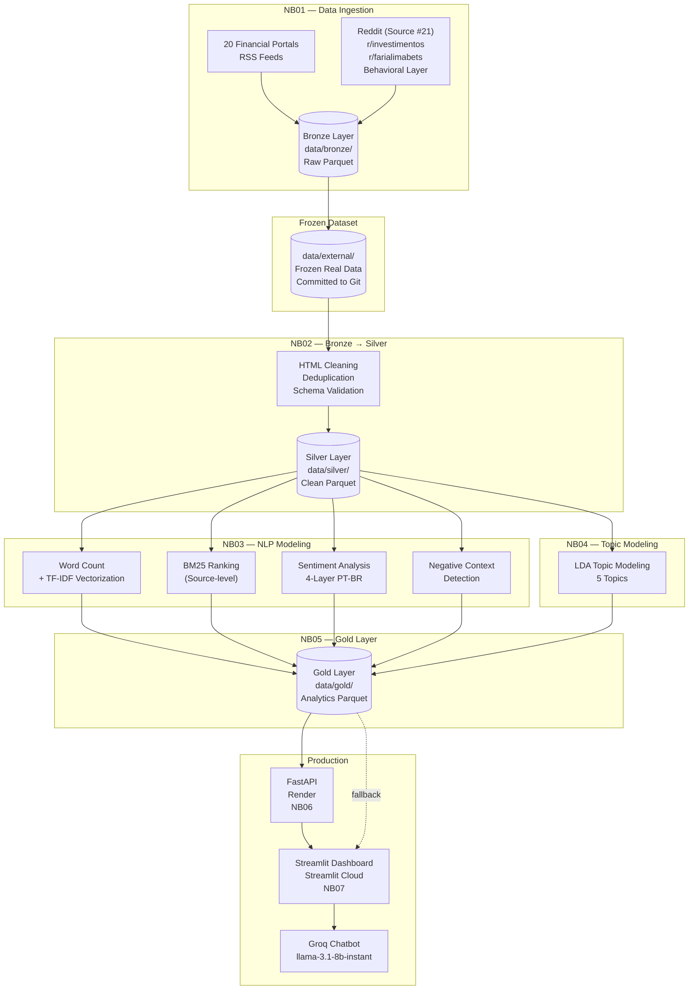

# Data Lineage
### **Investor Intelligence Platform - FIIs Brasil 🇧🇷**

  

## End-to-End Data Flow

  

## Layer Specifications

| Layer | Location | Format | Retention | Git |
|-------|----------|--------|-----------|-----|
| **Bronze** | `data/bronze/` | Parquet (partitioned by source) | Indefinite | ❌ gitignored |
| **Silver** | `data/silver/` | Parquet (single partition) | 6 months | ❌ gitignored |
| **Gold** | `data/gold/` | Parquet (one file per table) | Per analysis run | ❌ gitignored |
| **External (frozen)** | `data/external/` | Parquet + CSV + JSON | Permanent | ✅ committed |

  

## Transformation Lineage

### Bronze → Silver (NB02)

| Transformation | Input Field | Output Field | Logic |
|----------------|------------|--------------|-------|
| HTML stripping | `body_html` | `body` | BeautifulSoup |
| Deduplication | `url` | — | Drop exact URL duplicates |
| ID generation | `url` | `article_id` | `SHA-256(url)` |
| Date parsing | `published_date` (str) | `published_date` (timestamp) | PySpark `to_timestamp` |
| Quality filter | `body` | — | Drop if `word_count < 20` |
| Word count | `body` | `word_count` | `len(body.split())` |

 

### Silver → Gold (NB03–NB05)

| Output Table | Source Columns | Algorithm |
|-------------|---------------|-----------|
| `source_ranking` | `body`, `source` | BM25Okapi |
| `sentiment_by_source` | `body`, `source` | 4-layer PT-BR pipeline |
| `negative_context_terms` | `body`, `source` | Window co-occurrence |
| `topic_clusters` | `body` | LDA (Scikit-learn) |

  

## Reproducibility & System Guarantees

| Area | Mechanism | Purpose |
|---|---|---|
| **Bronze Layer** | Immutable ingestion | Preserves raw records without post-processing modifications |
| **Entity Consistency** | `article_id = SHA-256(url)` | Deterministic joins across pipeline executions |
| **Data Provenance** | `data_collection_report.json` | Tracks collection date, source counts, and dataset version |
| **Topic Modeling** | `RANDOM_SEED = 42` | Ensures reproducible LDA outputs across runs |

