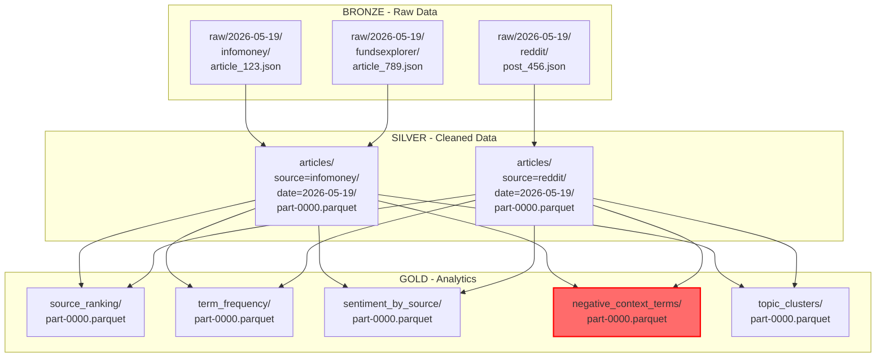
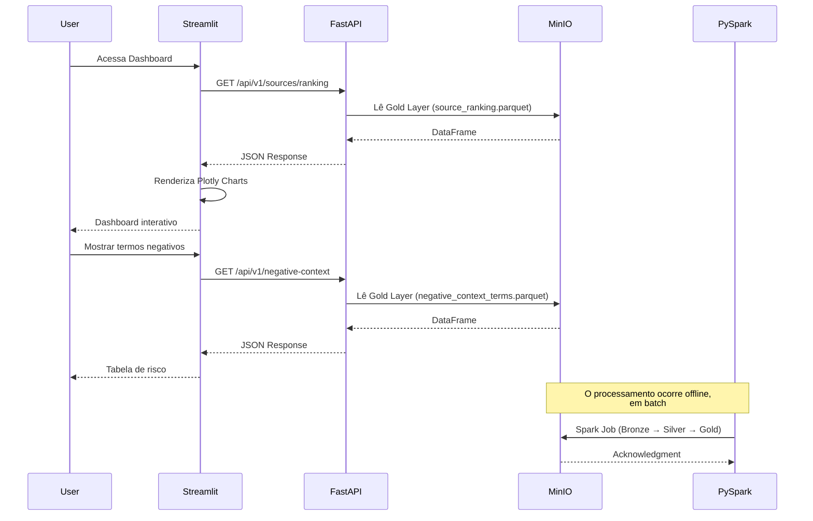
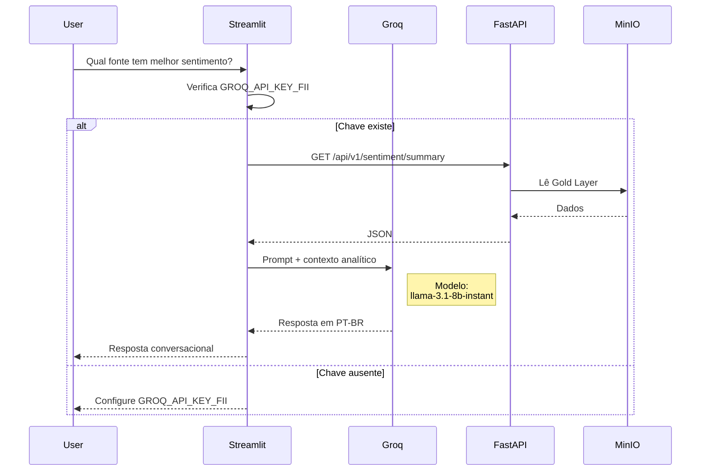
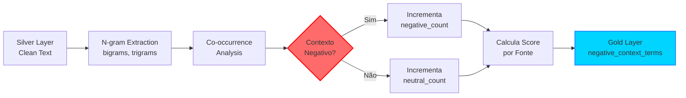

 # Stage 02 — Arquitetura Completa do Sistema

## Arquitetura técnica completa

Plataforma de Inteligência para FIIs — desenho end-to-end da solução.

## 1. Visão geral da arquitetura

### 1.1 Arquitetura em camadas

```mermaid
graph TB
    subgraph "PRESENTATION LAYER"
        A[Streamlit Dashboard + Chatbot]
        B[React Presentation]
    end
    
    subgraph "API LAYER"
        C[FastAPI Backend]
        D[Groq API Integration]
    end
    
    subgraph "PROCESSING LAYER"
        E[PySpark Distributed Engine]
        F[NLP + BM25 Engine]
        G[Sentiment Analysis]
        H[Negative Context Detector]
    end
    
    subgraph "INGESTION LAYER"
        I[Web Scraping System]
        J[20 Financial Portals]
        K[Reddit Scraper]
    end
    
    subgraph "STORAGE LAYER"
        L[MinIO Data Lake]
        M[Bronze Layer - Raw]
        N[Silver Layer - Cleaned]
        O[Gold Layer - Analytics]
    end
    
    J --> I
    K --> I
    I --> E
    E --> L
    L --> M
    M --> N
    N --> O
    E --> F
    E --> G
    F --> H
    G --> H
    O --> C
    C --> A
    A --> D
    C --> B
    
    style A fill:#00D4FF,stroke:#1E90FF,stroke-width:3px,color:#000
    style H fill:#FF6B6B,stroke:#FF0000,stroke-width:2px
    style L fill:#262730,stroke:#00D4FF,stroke-width:2px
```



### 1.2 Princípios arquiteturais

| Princípio | Descrição | Justificativa |
|---|---|---|
| Separation of Concerns | Separação clara entre ingestão, processamento, API e apresentação | Facilita manutenção, evolução e testes |
| Data Lake Architecture | Organização em Bronze, Silver e Gold para diferentes níveis de refinamento | Garante flexibilidade analítica e auditabilidade |
| Distributed Processing | Uso de PySpark para processamento paralelo | Sustenta escala para 21 fontes e grande volume de dados |
| API-First Design | Exposição dos dados via FastAPI e endpoints REST | Permite múltiplos consumidores, inclusive novos frontends no futuro |
| Modular NLP Pipeline | BM25, sentimento e contexto negativo como módulos independentes | Facilita ajustes finos, comparação de abordagens e evolução incremental |
| Graceful Degradation | O sistema continua operando mesmo com dependências opcionais indisponíveis | Mantém a experiência resiliente, inclusive sem chave Groq ou API completa |

## 2. Fluxo de dados completo

### 2.1 Pipeline end-to-end

```mermaid
flowchart LR
    subgraph "INGESTION"
        A1[Portal 1-20<br/>Scrapers]
        A2[Reddit<br/>Scraper]
    end
    
    subgraph "RAW STORAGE"
        B[MinIO<br/>Bronze Layer<br/>Raw JSON/HTML]
    end
    
    subgraph "SPARK PROCESSING"
        C1[Data Cleaning]
        C2[Schema Validation]
        C3[Deduplication]
        C4[Text Normalization]
    end
    
    subgraph "SILVER LAYER"
        D[MinIO Silver<br/>Structured Parquet<br/>Clean Text]
    end
    
    subgraph "NLP PROCESSING"
        E1[Tokenization]
        E2[Stopword Removal]
        E3[Lemmatization]
        E4[N-gram Extraction]
    end
    
    subgraph "ANALYTICS ENGINE"
        F1[BM25 Ranking]
        F2[TF-IDF]
        F3[Sentiment Analysis]
        F4[Topic Clustering]
        F5[Negative Context<br/>Detector]
    end
    
    subgraph "GOLD LAYER"
        G[MinIO Gold<br/>Analytics Tables<br/>Rankings, Scores]
    end
    
    subgraph "API & UI"
        H1[FastAPI]
        H2[Streamlit<br/>Dashboard]
        H3[Groq Chatbot]
    end
    
    A1 --> B
    A2 --> B
    B --> C1
    C1 --> C2
    C2 --> C3
    C3 --> C4
    C4 --> D
    D --> E1
    E1 --> E2
    E2 --> E3
    E3 --> E4
    E4 --> F1
    E4 --> F2
    E4 --> F3
    E4 --> F4
    F3 --> F5
    F1 --> G
    F2 --> G
    F3 --> G
    F4 --> G
    F5 --> G
    G --> H1
    H1 --> H2
    H2 --> H3
    
    style F5 fill:#FF6B6B,stroke:#FF0000,stroke-width:2px
    style G fill:#00D4FF,stroke:#1E90FF,stroke-width:2px
```



### 2.2 Detalhamento do fluxo por etapa

#### Etapa 1 — Ingestion (Scraping)

**Input:** URLs das 21 fontes.  
**Processo:**
- Scrapers assíncronos com retries.
- Rate limiting com cuidado em relação a `robots.txt`.
- Parsing de HTML com BeautifulSoup e lxml.
- Extração de título, data, corpo, autor e URL.

**Output:** JSON bruto com metadados.  
**Storage:** `s3://bronze/raw/YYYY-MM-DD/source_name/`

#### Etapa 2 — Bronze Layer (Raw Storage)

- **Formato:** JSON/HTML bruto.
- **Esquema:** sem imposição rígida; os dados são preservados como chegaram.
- **Propósito:** auditoria, rastreabilidade e reprocessamento.
- **Retenção:** 6 meses.

#### Etapa 3 — Spark Processing (Cleaning & Validation)

```python
# Pseudocódigo PySpark

df_bronze = spark.read.json("s3://bronze/raw/*")
df_cleaned = (df_bronze
    .filter(col("body").isNotNull())
    .filter(length(col("body")) > 100)
    .withColumn("clean_text", clean_html_udf(col("body")))
    .withColumn("word_count", size(split(col("clean_text"), " ")))
    .filter(col("word_count") > 50)
    .dropDuplicates(["url"]))
```

**Validações aplicadas:**
- ✅ corpo do texto não nulo;
- ✅ tamanho mínimo do conteúdo;
- ✅ remoção de tags HTML;
- ✅ deduplicação por URL.

**Output:** DataFrame limpo.

#### Etapa 4 — Silver Layer (Structured Storage)

- **Formato:** Parquet, por eficiência de leitura e compressão.
- **Esquema:**

```python
schema = StructType([
    StructField("article_id", StringType(), False),
    StructField("source", StringType(), False),
    StructField("title", StringType(), False),
    StructField("body", StringType(), False),
    StructField("clean_text", StringType(), False),
    StructField("published_date", TimestampType(), False),
    StructField("url", StringType(), False),
    StructField("word_count", IntegerType(), False),
    StructField("ingestion_timestamp", TimestampType(), False)
])
```

- **Particionamento:** por fonte e data, por exemplo `source=infomoney/date=2026-05-19/`.
- **Storage:** `s3://silver/articles/`

#### Etapa 5 — NLP Processing

```python
# Pipeline NLP
nlp_pipeline = Pipeline(stages=[
    Tokenizer(inputCol="clean_text", outputCol="tokens"),
    StopWordsRemover(inputCol="tokens", outputCol="filtered_tokens"),
    NGram(n=2, inputCol="filtered_tokens", outputCol="bigrams"),
    NGram(n=3, inputCol="filtered_tokens", outputCol="trigrams")
])
```

**Operações previstas:**
- Tokenização para quebrar o texto em unidades tratáveis.
- Remoção de stopwords para reduzir ruído.
- Lematização para aproximar variações semânticas.
- Extração de n-grams para capturar combinações como `FII calote` e `vacância alta`.

#### Etapa 6 — Analytics Engine

##### 6a. BM25 Ranking

```python
from rank_bm25 import BM25Okapi

corpus = [doc.split() for doc in df_silver.select("clean_text").collect()]
bm25 = BM25Okapi(corpus)

query = ["FII", "dividendo", "vacância", "P/VP", "gestão"]
scores = bm25.get_scores(query)

source_scores = df_silver.withColumn("bm25_score", lit(scores)) \
    .groupBy("source") \
    .agg(avg("bm25_score").alias("avg_bm25")) \
    .orderBy(desc("avg_bm25"))
```

##### 6b. Sentiment Analysis

```python
from textblob import TextBlob

def analyze_sentiment(text):
    blob = TextBlob(text)
    polarity = blob.sentiment.polarity
    if polarity > 0.1:
        return "positive"
    elif polarity < -0.1:
        return "negative"
    else:
        return "neutral"

df_sentiment = df_silver.withColumn(
    "sentiment",
    sentiment_udf(col("clean_text"))
)
```

##### 6c. Negative Context Detector (desafio extra)

```python
negative_keywords = ["calote", "lixo", "ruim", "armadilha", "golpe"]

def detect_negative_context(text, term="FII"):
    words = text.lower().split()
    negative_count = 0
    total_count = 0
    
    for i, word in enumerate(words):
        if term.lower() in word:
            total_count += 1
            window = words[max(0, i-5):min(len(words), i+6)]
            if any(neg in window for neg in negative_keywords):
                negative_count += 1
    
    return negative_count, total_count, negative_count / total_count if total_count > 0 else 0

negative_context_analysis = (df_sentiment
    .groupBy("source")
    .agg(
        count("*").alias("total_articles"),
        sum(when(col("sentiment") == "negative", 1).otherwise(0)).alias("negative_articles")
    ))
```

##### 6d. Topic Clustering

```python
from sklearn.decomposition import LatentDirichletAllocation
from sklearn.feature_extraction.text import TfidfVectorizer

vectorizer = TfidfVectorizer(max_features=1000, ngram_range=(1, 2))
tfidf_matrix = vectorizer.fit_transform(corpus)

lda = LatentDirichletAllocation(n_components=5, random_state=42)
topics = lda.fit_transform(tfidf_matrix)
```

**Exemplo de tópicos esperados:** FII de papel, FII de tijolo, gestão, dividendos e riscos.

#### Etapa 7 — Gold Layer (Analytics Tables)

- **Formato:** Parquet otimizado para leitura analítica.
- **Tabelas previstas:**
  - `source_ranking`
  - `term_frequency`
  - `sentiment_by_source`
  - `negative_context_terms`
  - `topic_clusters`
  - `time_series_sentiment`

**Exemplo de schema Gold:**

```python
source_ranking_schema = StructType([
    StructField("source", StringType(), False),
    StructField("avg_bm25_score", DoubleType(), False),
    StructField("total_articles", IntegerType(), False),
    StructField("positive_pct", DoubleType(), False),
    StructField("negative_pct", DoubleType(), False),
    StructField("neutral_pct", DoubleType(), False),
    StructField("negative_context_score", DoubleType(), False),
    StructField("strategic_rank", IntegerType(), False)
])
```

#### Etapa 8 — Consumo por API e UI

- **FastAPI:** expõe os dados da Gold Layer via endpoints REST.
- **Streamlit:** consome a API e renderiza os dashboards.
- **Chatbot Groq:** consulta a camada analítica por meio da API para responder com contexto.

## 3. Camadas Bronze, Silver e Gold

### 3.1 Arquitetura do data lake



### 3.2 Estratégia de armazenamento no MinIO

```text
fii-intelligence/
├── bronze/
│   └── raw/
│       ├── 2026-05-19/
│       │   ├── infomoney/
│       │   ├── valor_economico/
│       │   ├── reddit/
│       │   └── ... (21 fontes)
│       └── 2026-05-20/
├── silver/
│   └── articles/
│       ├── source=infomoney/
│       │   ├── date=2026-05-19/
│       │   └── date=2026-05-20/
│       └── source=reddit/
└── gold/
    ├── source_ranking/
    ├── term_frequency/
    ├── sentiment_by_source/
    ├── negative_context_terms/
    └── topic_clusters/
```

**Políticas de retenção:**
- Bronze: 6 meses, para auditoria e reprocessamento.
- Silver: 12 meses, para reuso estruturado e revisão de pipeline.
- Gold: retenção indefinida, por ser a base analítica histórica.

## 4. Interações entre componentes

### 4.1 Fluxo entre Streamlit, FastAPI, PySpark e MinIO



### 4.2 Fluxo do chatbot com Groq



### 4.3 Posicionamento do chatbot na arquitetura

| Componente | Tecnologia | Responsabilidade |
|---|---|---|
| UI | `st.chat_input` no Streamlit | Interface conversacional |
| LLM | Groq API com `llama-3.1-8b-instant` | Geração de respostas |
| Contexto | FastAPI + Gold Layer no MinIO | Fornecimento de dados analíticos |
| Prompt Engineering | Template customizado | Orientação do modelo sobre FII e leitura analítica |
| Segurança | `st.secrets["GROQ_API_KEY_FII"]` | Proteção de credenciais |

**Exemplo de prompt template:**

```python
SYSTEM_PROMPT = """
Você é um assistente especializado em análise de inteligência de mercado
para Fundos de Investimento Imobiliário (FII) brasileiros.

Contexto atual:
- Total de fontes analisadas: {total_sources}
- Fonte com maior BM25: {top_source}
- Sentimento geral: {overall_sentiment}
- Termos negativos detectados: {negative_terms}

Responda de forma concisa, objetiva e baseada nos dados fornecidos.
"""

user_query = "Qual fonte tem melhor sentimento sobre FII?"
context = fetch_context_from_api()
response = groq_client.chat(
    model="llama-3.1-8b-instant",
    messages=[
        {"role": "system", "content": SYSTEM_PROMPT.format(**context)},
        {"role": "user", "content": user_query}
    ]
)
```

## 5. Topologia de deploy

### 5.1 Deploy local (desenvolvimento)

```mermaid
graph TB
    subgraph "Local Machine"
        A[Docker Compose]
        B[MinIO Container<br/>Port 9000]
        C[PySpark Standalone<br/>Port 4040]
        D[FastAPI Container<br/>Port 8000]
        E[Streamlit Container<br/>Port 8501]
        F[Jupyter Notebook<br/>Port 8888]
    end
    
    A --> B
    A --> C
    A --> D
    A --> E
    A --> F
    
    C -.->|Read/Write| B
    D -.->|Read| B
    E -.->|HTTP| D
    
    style A fill:#262730,stroke:#00D4FF,stroke-width:2px
```



**Comando de startup:**

```bash
docker-compose up -d
```

**Serviços esperados:**
- MinIO: `http://localhost:9000`
- PySpark UI: `http://localhost:4040`
- FastAPI: `http://localhost:8000/docs`
- Streamlit: `http://localhost:8501`
- Jupyter: `http://localhost:8888`

### 5.2 Deploy em produção (Streamlit Cloud + Render)

```mermaid
graph TB
    subgraph "Streamlit Community Cloud"
        A[Streamlit App<br/>dashboard.streamlit.app]
    end
    
    subgraph "Render.com"
        B[FastAPI Backend<br/>api.render.com]
    end
    
    subgraph "Local/Scheduled"
        C[PySpark Job<br/>Batch Processing]
        D[MinIO / S3<br/>Data Lake]
    end
    
    subgraph "External APIs"
        E[Groq API]
    end
    
    C -.->|Write| D
    B -.->|Read| D
    A -->|HTTPS| B
    A -->|HTTPS| E
    
    style A fill:#00D4FF,stroke:#1E90FF,stroke-width:3px,color:#000
    style B fill:#262730,stroke:#00D4FF,stroke-width:2px
```



**Fluxo de deploy:**
- PySpark Job executado localmente ou em servidor agendado, com rotina diária.
- MinIO ou S3 como data lake persistente.
- FastAPI publicado no Render.
- Streamlit publicado no Streamlit Community Cloud.
- Groq acessado como API externa, com chave segura em `st.secrets`.[web:130]

## 6. Justificativa das escolhas tecnológicas

### 6.1 Por que PySpark?

| Requisito | Alternativa | Por que PySpark venceu |
|---|---|---|
| Processar 21 fontes | Pandas | Escala melhor em cenários distribuídos |
| Milhões de artigos | Dask | Ecossistema mais consolidado para pipelines de dados |
| NLP em escala | spaCy puro | Integra melhor com pipeline distribuído e transformação em lote |
| Formato Parquet | CSV | Leitura nativa e eficiente |
| Requisito acadêmico | Qualquer stack | O briefing exige PySpark |

### 6.2 Por que MinIO?

| Requisito | Alternativa | Por que MinIO venceu |
|---|---|---|
| Data lake local | PostgreSQL | MinIO é object storage compatível com S3 |
| Bronze/Silver/Gold | File system simples | Estrutura mais aderente ao conceito de data lake |
| Armazenamento em Parquet | MongoDB | Melhor aderência ao consumo analítico |
| Deploy simples | HDFS real | Roda bem em Docker sem exigir cluster complexo |

### 6.3 Por que BM25?

| Requisito | Alternativa | Por que BM25 venceu |
|---|---|---|
| Ranking de fontes | TF-IDF isolado | BM25 é mais robusto para relevância textual |
| Relevância de conteúdo | Heurística manual | Menos arbitrário e mais defensável |
| Explainability | Deep learning | Score mais interpretável |

### 6.4 Por que Groq com `llama-3.1-8b-instant`?

| Requisito | Alternativa | Por que Groq venceu |
|---|---|---|
| Baixa latência | OpenAI GPT-4 | Melhor foco em inferência rápida |
| Custo | Anthropic Claude | Acesso mais viável em cenário experimental e educacional |
| PT-BR | Modelos locais | Boa base multilíngue |
| Deploy em Streamlit | Fine-tuned local | Integração por API é mais simples |

### 6.5 Por que Streamlit?

| Requisito | Alternativa | Por que Streamlit venceu |
|---|---|---|
| Prototipação rápida | React + Flask | Desenvolvimento mais direto em Python |
| Deploy gratuito | Heroku | Streamlit Community Cloud simplifica publicação |
| Integração com Plotly | Dash | Menor complexidade operacional |
| Chatbot nativo | React customizado | `st.chat_input` reduz esforço de implementação |

## 7. Fidelidade ao briefing acadêmico

### 7.1 Mapeamento entre arquitetura e requisitos

| Requisito do briefing | Componente arquitetural | Justificativa |
|---|---|---|
| Processar sites e redes sociais | Web Scraping System (20 portais + Reddit) | Garante ingestão automatizada e comparável |
| Contar palavras | PySpark NLP Pipeline | Sustenta processamento distribuído e análise textual |
| Identificar termos relevantes | BM25 Engine + TF-IDF | Combina ranking probabilístico com sinal estatístico |
| PySpark e Jupyter | Processing Layer + Notebook | Atende requisito técnico e didático |
| Dashboard com gráficos | Streamlit + Plotly | Entrega visualização executiva |
| Análise de sentimento | NLP Sentiment Analysis | Classificação em positivo, negativo e neutro |
| Desafio extra: termos negativos | Negative Context Detector | Cria módulo específico para leitura de risco contextual |

### 7.2 Como o desafio extra entra na arquitetura

**Fluxo do Negative Context Detector:**
- **Input:** Silver Layer com textos já limpos.
- **Processamento:**
  - extração de bigramas e trigramas;
  - análise de coocorrência com termos negativos próximos de `FII`;
  - cálculo de `negative_context_score = ocorrências_negativas / total_ocorrências`.
- **Agregação por fonte:** cada fonte recebe um score de risco.
- **Output:** `gold/negative_context_terms/`.
- **Visualização:** seção dedicada de análise de risco no dashboard.
- **Impacto:** o score também entra no ranking estratégico de fontes.



## 8. Decisões críticas de design

### 8.1 Por que batch processing, e não real time?

**Decisão:** o pipeline roda em batch, diariamente ou sob demanda.  
**Justificativa:**
- Reduz complexidade de infraestrutura.
- Evita custo contínuo de computação.
- Continua aderente ao briefing.
- É suficiente para inteligência estratégica sobre FIIs.
- Facilita reprocessamento, rastreabilidade e debugging.

**Trade-off aceito:** a latência dos dados fica em torno de 24 horas, o que é aceitável para esse contexto.

### 8.2 Por que REST, e não GraphQL?

**Decisão:** FastAPI com API REST.  
**Justificativa:**
- Implementação mais simples.
- Documentação mais direta.
- Consumo natural pelo Streamlit.
- Uso de cache HTTP padrão.
- As consultas previstas não exigem a complexidade adicional de GraphQL.

### 8.3 Por que não usar RAG na V1?

**Decisão:** chatbot com LLM + contexto estruturado, sem RAG na primeira versão.  
**Justificativa:**
- RAG aumentaria bastante a complexidade da solução.
- O briefing não exige essa camada.
- O Gold Layer já fornece contexto suficiente para boa parte das perguntas.
- Fica como evolução natural para uma V2.

**Possível evolução futura:**  
Gold Layer → Embeddings → Vector DB → RAG Pipeline → Groq LLM.

## 9. Resumo executivo da arquitetura

### 9.1 Componentes principais

| Componente | Tecnologia | Responsabilidade | Camada |
|---|---|---|---|
| Web Scrapers | BeautifulSoup, Requests | Ingestão de dados brutos | Ingestion |
| MinIO Bronze | MinIO | Armazenamento bruto | Storage |
| PySpark Engine | PySpark 3.5+ | Processamento distribuído | Processing |
| MinIO Silver | MinIO + Parquet | Dados limpos e estruturados | Storage |
| NLP Pipeline | spaCy, NLTK, TextBlob | Limpeza, tokenização e análise | Processing |
| BM25 Engine | rank-bm25 | Ranking de relevância | Analytics |
| Sentiment Analyzer | TextBlob, spaCy | Sentimento | Analytics |
| Negative Context Detector | Lógica customizada | Contexto negativo | Analytics |
| MinIO Gold | MinIO + Parquet | Tabelas analíticas | Storage |
| FastAPI | FastAPI 0.110+ | API REST | API Layer |
| Streamlit | Streamlit 1.32+ | Dashboard interativo | Presentation |
| Groq Chatbot | Groq API + `llama-3.1-8b-instant` | Respostas conversacionais | Presentation |
| Plotly | Plotly 5.18+ | Visualizações | Presentation |
| Docker Compose | Docker | Orquestração local | Infrastructure |

### 9.2 Fluxo de valor resumido

`21 fontes → scraping → Bronze (raw) → PySpark (clean) → Silver (structured) → NLP + BM25 + sentiment + negative context → Gold (analytics) → FastAPI → Streamlit Dashboard + Groq Chatbot → insights acionáveis`

### 9.3 KPIs de arquitetura

| Métrica | Target | Como medir |
|---|---|---|
| Throughput de scraping | 21 fontes em menos de 2h | Logs de scraping |
| Latência do Spark Job | Bronze → Gold em menos de 1h | Métricas da Spark UI |
| Latência da API | p95 abaixo de 500 ms | Logs do FastAPI |
| Latência do chatbot | Resposta em menos de 3s | Medição no Streamlit |
| Tamanho do data lake | Menos de 10 GB em 6 meses | Métricas do MinIO |
| Acurácia de sentimento | Acima de 80% | Validação manual |
| Recall de contexto negativo | Acima de 90% | Avaliação manual |
