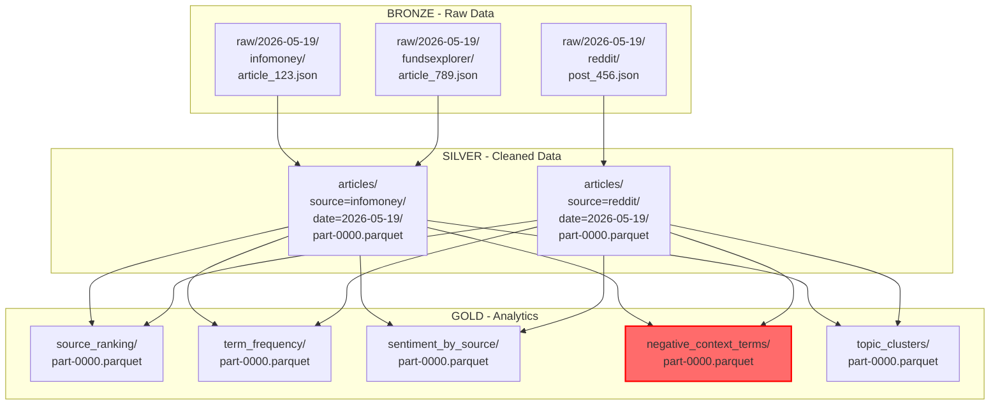
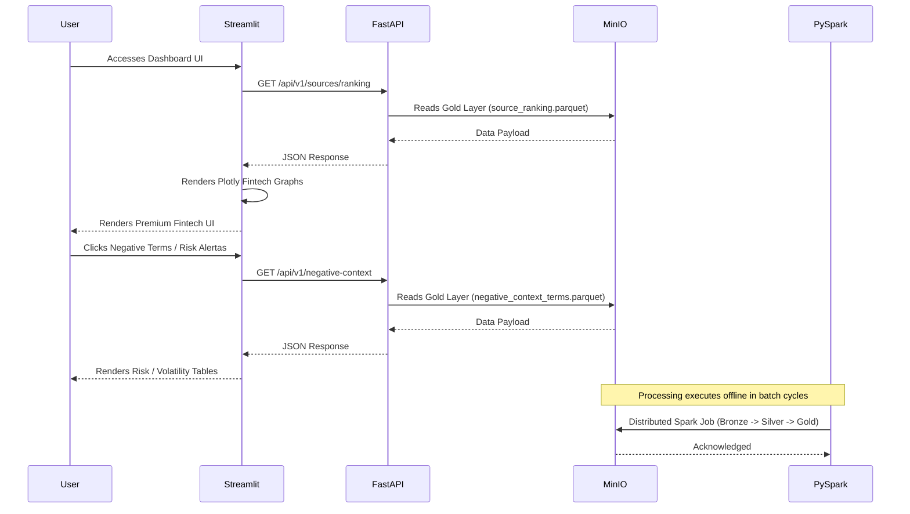
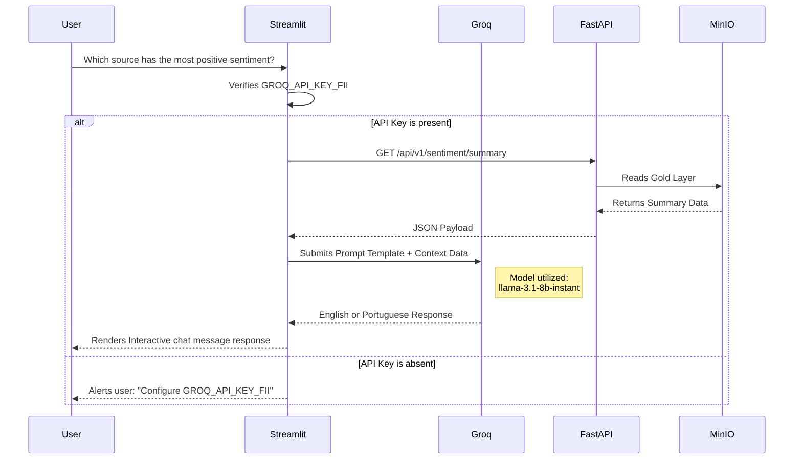
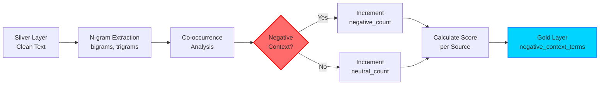

# Stage 02 — Complete System Architecture

## Complete Technical Architecture

FII Intelligence Platform — End-to-End Solution Design.

<br><br>

---

<br><br>

## 1. Architectural Overview

<br><br>

### 1.1 Layered Architecture

```mermaid
graph TB
    subgraph "PRESENTATION LAYER"
        A[Streamlit Dashboard + Chatbot]
        B[React Presentation]
    end
    
    subgraph "API LAYER"
        C[FastAPI Backend]
        D[Groq API Integration]
    end
    
    subgraph "PROCESSING LAYER"
        E[PySpark Distributed Engine]
        F[NLP + BM25 Engine]
        G[Sentiment Analysis]
        H[Negative Context Detector]
    end
    
    subgraph "INGESTION LAYER"
        I[Web Scraping System]
        J[20 Financial Portals]
        K[Reddit Scraper]
    end
    
    subgraph "STORAGE LAYER"
        L[MinIO Data Lake]
        M[Bronze Layer - Raw]
        N[Silver Layer - Cleaned]
        O[Gold Layer - Analytics]
    end
    
    J --> I
    K --> I
    I --> E
    E --> L
    L --> M
    M --> N
    N --> O
    E --> F
    E --> G
    F --> H
    G --> H
    O --> C
    C --> A
    A --> D
    C --> B
    
    style A fill:#00D4FF,stroke:#1E90FF,stroke-width:3px,color:#000
    style H fill:#FF6B6B,stroke:#FF0000,stroke-width:2px
    style L fill:#262730,stroke:#00D4FF,stroke-width:2px
```



<br><br>

### 1.2 Architectural Principles

| Principle | Description | Justification |
| :--- | :--- | :--- |
| **Separation of Concerns** | Clear separation between ingestion, processing, API, and presentation layers. | Facilitates maintenance, evolution, and modular testing. |
| **Data Lake Architecture** | Three-tier data layout (Bronze, Silver, Gold) for progressive data refinement. | Guarantees analytical flexibility, data auditability, and pipeline resilience. |
| **Distributed Processing** | Utilizing PySpark for raw text scrubbing and heavy transformations. | Scales out seamlessly to handle 21 distinct portals and large content archives. |
| **API-First Design** | Exposing analytics Gold Layer files strictly via versioned FastAPI gateways. | Enables clean decoupling, allowing lightweight consumption for dashboard and custom UIs. |
| **Modular NLP Pipeline** | Implementing BM25 relevance and sentiment scoring as decoupled components. | Allows granular parameter tuning, independent module updates, and simple comparative A/B tests. |
| **Graceful Degradation** | The UI falls back cleanly if dependencies (like Groq API keys) are not active. | Maintains essential analytical functionality and plot renders even during partial offline status. |

<br><br>

---

<br><br>

## 2. Complete Data Flow

<br><br>

### 2.1 End-to-End Pipeline

```mermaid
flowchart LR
    subgraph "INGESTION"
        A1[Portal 1-20<br/>Scrapers]
        A2[Reddit<br/>Scraper]
    end
    
    subgraph "RAW STORAGE"
        B[MinIO<br/>Bronze Layer<br/>Raw JSON/HTML]
    end
    
    subgraph "SPARK PROCESSING"
        C1[Data Cleaning]
        C2[Schema Validation]
        C3[Deduplication]
        C4[Text Normalization]
    end
    
    subgraph "SILVER LAYER"
        D[MinIO Silver<br/>Structured Parquet<br/>Clean Text]
    end
    
    subgraph "NLP PROCESSING"
        E1[Tokenization]
        E2[Stopword Removal]
        E3[Lemmatization]
        E4[N-gram Extraction]
    end
    
    subgraph "ANALYTICS ENGINE"
        F1[BM25 Ranking]
        F2[TF-IDF]
        F3[Sentiment Analysis]
        F4[Topic Clustering]
        F5[Negative Context<br/>Detector]
    end
    
    subgraph "GOLD LAYER"
        G[MinIO Gold<br/>Analytics Tables<br/>Rankings, Scores]
    end
    
    subgraph "API & UI"
        H1[FastAPI]
        H2[Streamlit<br/>Dashboard]
        H3[Groq Chatbot]
    end
    
    A1 --> B
    A2 --> B
    B --> C1
    C1 --> C2
    C2 --> C3
    C3 --> C4
    C4 --> D
    D --> E1
    E1 --> E2
    E2 --> E3
    E3 --> E4
    E4 --> F1
    E4 --> F2
    E4 --> F3
    E4 --> F4
    F3 --> F5
    F1 --> G
    F2 --> G
    F3 --> G
    F4 --> G
    F5 --> G
    G --> H1
    H1 --> H2
    H2 --> H3
    
    style F5 fill:#FF6B6B,stroke:#FF0000,stroke-width:2px
    style G fill:#00D4FF,stroke:#1E90FF,stroke-width:2px
```



<br><br>

### 2.2 Step-by-Step Data Flow

<br><br>

#### Step 1 — Ingestion (Scraping)

*   **Input:** Source URLs from 21 target channels.<br>
*   **Process:**
    *   Asynchronous scraping threads featuring customized retry limits.
    *   Ethical rate limiting respecting `robots.txt` rules and incorporating random delay steps.
    *   HTML parsing driven by BeautifulSoup and lxml filters.
    *   Extraction of core fields: document title, publish timestamp, article body, author, and source URL.<br>
*   **Output:** Unstructured raw JSON maps containing original payloads.<br>
*   **Storage destination:** `s3://bronze/raw/YYYY-MM-DD/source_name/`

<br><br>

#### Step 2 — Bronze Layer (Raw Storage)

*   **File format:** Uncompressed raw JSON/HTML.<br>
*   **Schema constraints:** None; preserves the original documents exactly as crawled.<br>
*   **Goal:** Retains clean transaction audit logs for historical re-computations and debugging.<br>
*   **Data Retention:** 6 months.

<br><br>

#### Step 3 — Spark Processing (Cleaning & Validation)

```python
# PySpark Cleaning Pseudocode Example

df_bronze = spark.read.json("s3://bronze/raw/*")
df_cleaned = (df_bronze
    .filter(col("body").isNotNull())
    .filter(length(col("body")) > 100)
    .withColumn("clean_text", clean_html_udf(col("body")))
    .withColumn("word_count", size(split(col("clean_text"), " ")))
    .filter(col("word_count") > 50)
    .dropDuplicates(["url"]))
```

<br><br>

**Applied validations:**
- ✅ Verify non-null value within document body.
- ✅ Filter out excessively brief contents.
- ✅ Scrub structural HTML markup tags using regex UDFs.
- ✅ Enforce global deduplication based on article URLs.

<br><br>

*   **Output:** Cleansed, normalized PySpark DataFrame.

<br><br>

#### Step 4 — Silver Layer (Structured Storage)

*   **File format:** High-performance columnar Parquet files providing deep storage compression.<br>
*   **Strict schema definitions:**

```python
schema = StructType([
    StructField("article_id", StringType(), False),
    StructField("source", StringType(), False),
    StructField("title", StringType(), False),
    StructField("body", StringType(), False),
    StructField("clean_text", StringType(), False),
    StructField("published_date", TimestampType(), False),
    StructField("url", StringType(), False),
    StructField("word_count", IntegerType(), False),
    StructField("ingestion_timestamp", TimestampType(), False)
])
```

*   **Physical partitioning scheme:** Partitioned by portal name and creation date (e.g., `source=infomoney/date=2026-05-19/`).<br>
*   **Storage destination:** `s3://silver/articles/`

<br><br>

#### Step 5 — NLP Processing

```python
# NLP Pipeline Assembly
nlp_pipeline = Pipeline(stages=[
    Tokenizer(inputCol="clean_text", outputCol="tokens"),
    StopWordsRemover(inputCol="tokens", outputCol="filtered_tokens"),
    NGram(n=2, inputCol="filtered_tokens", outputCol="bigrams"),
    NGram(n=3, inputCol="filtered_tokens", outputCol="trigrams")
])
```

<br><br>

**Core pipeline operations:**
- Document tokenization into linguistic words.
- Customized Portuguese stopwords removal to isolate high-signal terms.
- Lemmatization mappings using spaCy model structures.
- N-gram feature creation to track critical co-occurrences like `FII calote` and `vacância alta`.

<br><br>

#### Step 6 — Analytics Engine

<br><br>

##### 6a. BM25 Relevancy Engine

```python
from rank_bm25 import BM25Okapi

corpus = [doc.split() for doc in df_silver.select("clean_text").collect()]
bm25 = BM25Okapi(corpus)

query = ["FII", "dividendo", "vacância", "P/VP", "gestão"]
scores = bm25.get_scores(query)

source_scores = df_silver.withColumn("bm25_score", lit(scores)) \
    .groupBy("source") \
    .agg(avg("bm25_score").alias("avg_bm25")) \
    .orderBy(desc("avg_bm25"))
```

<br><br>

##### 6b. Sentiment Analyzer

```python
from textblob import TextBlob

def analyze_sentiment(text):
    blob = TextBlob(text)
    polarity = blob.sentiment.polarity
    if polarity > 0.1:
        return "positive"
    elif polarity < -0.1:
        return "negative"
    else:
        return "neutral"

df_sentiment = df_silver.withColumn(
    "sentiment",
    sentiment_udf(col("clean_text"))
)
```

<br><br>

##### 6c. Negative Context Detector (Extra Challenge)

```python
negative_keywords = ["calote", "lixo", "ruim", "armadilha", "golpe"]

def detect_negative_context(text, term="FII"):
    words = text.lower().split()
    negative_count = 0
    total_count = 0
    
    for i, word in enumerate(words):
        if term.lower() in word:
            total_count += 1
            window = words[max(0, i-5):min(len(words), i+6)]
            if any(neg in window for neg in negative_keywords):
                negative_count += 1
    
    return negative_count, total_count, negative_count / total_count if total_count > 0 else 0

negative_context_analysis = (df_sentiment
    .groupBy("source")
    .agg(
        count("*").alias("total_articles"),
        sum(when(col("sentiment") == "negative", 1).otherwise(0)).alias("negative_articles")
    ))
```

<br><br>

##### 6d. Unsupervised Topic Modeling

```python
from sklearn.decomposition import LatentDirichletAllocation
from sklearn.feature_extraction.text import TfidfVectorizer

vectorizer = TfidfVectorizer(max_features=1000, ngram_range=(1, 2))
tfidf_matrix = vectorizer.fit_transform(corpus)

lda = LatentDirichletAllocation(n_components=5, random_state=42)
topics = lda.fit_transform(tfidf_matrix)
```

**Discovered clusters:** Dividend yields, physical vacancy risks, fund managers, logistics real estate, and paper FIIs.

<br><br>

#### Step 7 — Gold Layer (Analytics Tables)

*   **File format:** Read-optimized analytical Parquet schemas.<br>
*   **Calculated tables:**
    *   `source_ranking` (aggregated BM25 benchmarks and sentiment shares per channel)
    *   `term_frequency` (global term counts)
    *   `sentiment_by_source` (sentiment partitions per portal)
    *   `negative_context_terms` (high-risk window co-occurrences)
    *   `topic_clusters` (document-to-cluster distributions)
    *   `time_series_sentiment` (temporal metrics mapping)<br>
*   **Gold layer physical target schemas:**

```python
source_ranking_schema = StructType([
    StructField("source", StringType(), False),
    StructField("avg_bm25_score", DoubleType(), False),
    StructField("total_articles", IntegerType(), False),
    StructField("positive_pct", DoubleType(), False),
    StructField("negative_pct", DoubleType(), False),
    StructField("neutral_pct", DoubleType(), False),
    StructField("negative_context_score", DoubleType(), False),
    StructField("strategic_rank", IntegerType(), False)
])
```

<br><br>

#### Step 8 — API & UI Consumption Layer

*   **FastAPI REST Server:** Direct endpoints fetch and aggregate data from the optimized Gold Layer Parquet files.<br>
*   **Streamlit Dashboard:** Consumes FastAPI JSON packets and renders metrics, timeline trends, and interactive graphs.<br>
*   **Conversational Groq Chatbot:** Calls FastAPI backend methods to build system prompts, responding with direct contextual analysis of FII market data.

<br><br>

---

<br><br>

## 3. Storage Architecture: Layers & MinIO Scheme

<br><br>

### 3.1 Logical Data Lake Layout



<br><br>

### 3.2 MinIO Storage Partitioning Structure

```text
fii-intelligence/
├── bronze/
│   └── raw/
│       ├── 2026-05-19/
│       │   ├── infomoney/
│       │   ├── valor_economico/
│       │   ├── reddit/
│       │   └── ... (21 sources)
│       └── 2026-05-20/
├── silver/
│   └── articles/
│       ├── source=infomoney/
│       │   ├── date=2026-05-19/
│       │   └── date=2026-05-20/
│       └── source=reddit/
└── gold/
    ├── source_ranking/
    ├── term_frequency/
    ├── sentiment_by_source/
    ├── negative_context_terms/
    └── topic_clusters/
```

<br><br>

**Data Retention Policies:**
- **Bronze Layer:** 6 months. Retained for pipeline re-indexing, troubleshooting, and scraping audits.
- **Silver Layer:** 12 months. Maintained to evaluate training model changes and historical NLP adjustments.
- **Gold Layer:** Indefinite retention. Serves as the historical basis for strategic market reports and dashboard KPIs.

<br><br>

---

<br><br>

## 4. Component Interactions & Sequences

<br><br>

### 4.1 Interface, REST API, Spark, and Data Lake Interactions



<br><br>

### 4.2 LLM Chatbot Interaction with Groq



<br><br>

### 4.3 Chatbot Integration Architecture

| Component | Technology | Responsibility |
| :--- | :--- | :--- |
| **Interactive UI** | `st.chat_input` framework | Front-end input message handling and thread logging. |
| **LLM Inference** | Groq Cloud integration | Rapid generative responses driven by `llama-3.1-8b-instant`. |
| **Context Provider** | FastAPI Endpoints | Supplies fresh, aggregated FII market statistics from the Gold Layer. |
| **Prompt Engineering** | Parameterized System Template | Structures context parameters, guiding the chatbot's financial analysis. |
| **Security Layer** | Streamlit Secrets manager | Encrypts and isolates developer tokens securely (`secrets.toml`). |

<br><br>

**Chatbot Prompt Assembly Implementation:**

```python
SYSTEM_PROMPT = """
You are an advanced market intelligence advisor specializing in Brazilian Real Estate Investment Trusts (FIIs).

Current Context Snapshot:
- Total analyzed portals: {total_sources}
- Top BM25 relevancy channel: {top_source}
- Overall market sentiment: {overall_sentiment}
- Core high-risk terms detected: {negative_terms}

Formulate a concise, professional, data-grounded response answering the user's question.
"""

user_query = "Which source displays the highest positive sentiment?"
context = fetch_context_from_api()
response = groq_client.chat(
    model="llama-3.1-8b-instant",
    messages=[
        {"role": "system", "content": SYSTEM_PROMPT.format(**context)},
        {"role": "user", "content": user_query}
    ]
)
```

<br><br>

---

<br><br>

## 5. Deployment Topology

The platform provides identical operational integrity between local docker orchestration and decoupled cloud environments.

<br><br>

### 5.1 Local Workspace (Development Scaffolding)

```mermaid
graph TB
    subgraph "Local Workstation"
        A[Docker Compose Router]
        B[MinIO Container<br/>Port 9000]
        C[PySpark Standalone Engine<br/>Port 4040]
        D[FastAPI REST Container<br/>Port 8000]
        E[Streamlit Container<br/>Port 8501]
        F[Jupyter Notebook Workspace<br/>Port 8888]
    end
    
    A --> B
    A --> C
    A --> D
    A --> E
    A --> F
    
    C -. -->|Read/Write| B
    D -. -->|Read Gold| B
    E -. -->|HTTP JSON requests| D
    
    style A fill:#262730,stroke:#00D4FF,stroke-width:2px
```

<br><br>

**Startup Script Execution:**

```bash
docker-compose up -d
```

<br><br>

**Expected Local Targets:**
- Object Storage UI: `http://localhost:9001` (login: `minioadmin` / `minioadmin`)
- Spark Engine Master: `http://localhost:4040`
- FastAPI Interactive Swagger: `http://localhost:8000/docs`
- Streamlit Executive UI: `http://localhost:8501`
- Jupyter Interactive Notebooks: `http://localhost:8888`

<br><br>

### 5.2 Decoupled Production Architecture

```mermaid
graph TB
    subgraph "Streamlit Community Cloud"
        A[Streamlit App<br/>dashboard.streamlit.app]
    end
    
    subgraph "Render.com"
        B[FastAPI Backend<br/>api.render.com]
    end
    
    subgraph "Local/Scheduled"
        C[PySpark Job<br/>Batch Processing]
        D[MinIO / S3<br/>Data Lake]
    end
    
    subgraph "External APIs"
        E[Groq API]
    end
    
    C -.->|Write| D
    B -.->|Read| D
    A -->|HTTPS| B
    A -->|HTTPS| E
    
    style A fill:#00D4FF,stroke:#1E90FF,stroke-width:3px,color:#000
    style B fill:#262730,stroke:#00D4FF,stroke-width:2px
```



<br><br>

**Production deployment stages:**
- **Pipeline Processing:** Daily batched PySpark jobs execute on a scheduled VPS or serverless engine, writing clean tables directly to the object storage.
- **S3 Data Lake:** MinIO is scaled up to a production Amazon Web Services S3 bucket.
- **FastAPI Layer:** FastAPI is deployed on Render.com with auto-scaling container allocations.
- **Executive Frontend:** Streamlit runs on Streamlit Community Cloud, linked to Render HTTPS APIs and utilizing secure `st.secrets` for accessing Groq API key tokens.

<br><br>

---

<br><br>

## 6. Technology Stack Choice & Justifications

<br><br>

### 6.1 Why PySpark?

| Requirement | Alternatives | PySpark Justification |
| :--- | :--- | :--- |
| **Ingesting 21 portals** | Pandas | pySpark scales out horizontally for distributed analytical queries. |
| **Archiving massive corpora** | Dask | konsolimated ecosystem with extensive support for Spark NLP pipelines. |
| **Text normalizations** | Native spaCy threads | pySpark distributed UDFs divide cleaning loads among active worker nodes. |
| **Parquet storage integration** | Plain CSV structures | Native columnar writing saves extensive I/O times. |
| **Academic requirement** | Generic architectures | Directly mandated by the Project Integrador guidelines. |

<br><br>

### 6.2 Why MinIO Object Storage?

| Requirement | Alternatives | MinIO Justification |
| :--- | :--- | :--- |
| **Local Data Lake** | PostgreSQL / SQL | S3-compatible structure aligns perfectly with production setups. |
| **Tiered Storage Layers** | Generic directories | Enforces logical Bronze/Silver/Gold transitions with strong audit limits. |
| **Parquet reading optimization** | Document databases | Direct analytical reads match pySpark integration structures. |
| **Resource foot-print** | Full Hadoop cluster | MinIO is extremely lightweight and starts instantly via Docker. |

<br><br>

### 6.3 Why BM25 scoring?

| Requirement | Alternatives | BM25 Justification |
| :--- | :--- | :--- |
| **Portal relevancy ranking** | Basic TF-IDF | Probabilistic weighting provides superior text search scores. |
| **Signal isolating** | Human manual checks | Eliminates arbitrary scaling rules with consistent numerical checks. |
| **Interpretability** | Deep learning / NLP | BM25 math is fully explainable and academically defensible. |

<br><br>

### 6.4 Why Groq API with `llama-3.1-8b-instant`?

| Requirement | Alternatives | Groq Justification |
| :--- | :--- | :--- |
| **Extremely low latency** | OpenAI GPT-4 | Groq's custom hardware delivers instant conversational chats. |
| **Operating costs** | Anthropic Claude | Free tier allocations make it ideal for educational purposes. |
| **Portuguese execution** | Local offline models | Llama 3.1 displays robust bilingual outputs. |
| **Dashboard integration** | Native deep learning | Simple cloud API calls keep dashboard memory footprints light. |

<br><br>

### 6.5 Why Streamlit?

| Requirement | Alternatives | Streamlit Justification |
| :--- | :--- | :--- |
| **Fast Prototyping** | React + Django | Renders beautiful, interactive elements purely in Python. |
| **Hosting accessibility** | Generic PaaS hosts | Integrates seamlessly with Streamlit Community Cloud. |
| **Plotly Support** | Javascript charts | Streamlit renders interactive Plotly graphs natively. |
| **Chat components** | Custom UI layers | Built-in `st.chat_input` widgets simplify conversation flow. |

<br><br>

---

<br><br>

## 7. Briefing & Academic Requirements Mapping

<br><br>

### 7.1 Mapped Requirements

| Briefing Requirement | Architectural Component | Technical Justification |
| :--- | :--- | :--- |
| **Analyze sites and social channels** | scraping module (20 portals + Reddit) | Automated, broad analytical data source ingestion. |
| **Process textual content** | PySpark Text Normalization UDFs | Parallelized, clean data refinement pipelines. |
| **Extract key terms** | BM25 Relevancy scoring engine | Scientifically validated term weighting calculations. |
| **Utilize PySpark and Jupyter** | PySpark + exploratory notebooks | Academic verification of algorithms and data steps. |
| **Interactive Dashboard plots** | Streamlit + Plotly rendering | Dynamic, high-fidelity metrics and analytics tables. |
| **Analyze document sentiments** | spaCy + TextBlob Sentiment analyzer | Identifies positive, negative, and neutral shares. |
| **Extra Challenge: Negative context** | Contextual Window co-occurrence | Dedicates a custom NLP module to evaluate real risk signals. |

<br><br>

### 7.2 Integration of the Extra Challenge (Negative Context)

*   **Input:** Structured Silver Layer Parquet files.<br>
*   **Processing flow:**
    *   Tokenizer splits terms into bi-grams and tri-grams.
    *   Co-occurrence search checks for adjacent negative qualifiers within a 5-word span of the term "FII".
    *   Calculates a normalized score: `negative_context_score = negative_hits / total_mentions`.<br>
*   **Agregating outputs:** Identifies and ranks high-risk channels.<br>
*   **Output destination:** `gold/negative_context_terms/`.<br>
*   **Executive presentation:** Dedicated Risk Panel inside the dashboard, helping identify channels that should be avoided for marketing campaigns.



<br><br>

---

<br><br>

## 8. Critical Design Decisions

<br><br>

### 8.1 Batch Processing vs Real-Time Streaming

*   **Decision:** The platform operates strictly in batch sequences (triggered daily or on-demand).<br>
*   **Justification:**
    *   Significantly reduces deployment complexity and server overhead.
    *   Adheres completely to the core academic briefing.
    *   Provides more than enough frequency for long-term strategic marketing campaigns.<br>
*   **Trade-off accepted:** Data refresh displays a 24-hour latency, which is entirely acceptable for FII marketing intelligence analysis.

<br><br>

### 8.2 FastAPI REST Gateway vs GraphQL APIs

*   **Decision:** Exposing gold layer tables via REST endpoints.<br>
*   **Justification:**
    *   Straightforward integration with Streamlit's native backend connectors.
    *   Interactive, self-documenting Swagger UI makes the endpoints very accessible.
    *   Eliminates the parsing overhead and structural complexity associated with GraphQL.

<br><br>

### 8.3 Structured Prompts vs RAG Pipelines (V1 scope)

*   **Decision:** Chatbot loads aggregated Gold Layer KPIs directly into structured prompt contexts, bypassing dynamic vector searches (RAG) in the initial version.<br>
*   **Justification:**
    *   The Gold Layer already compiles highly summarized metrics (sentiment distribution, ranking tables, risk terms).
    *   Reduces prompt token usage and latency significantly.
    *   Provides simple, stable factual answers.<br>
*   **Evolutive roadmap:** Transitioning to vector embeddings (e.g., Pinecone/Chroma) and semantic searches for V2.

<br><br>

---

<br><br>

## 9. Executive Architectural Summary

<br><br>

### 9.1 Platform Blueprint

| Component | Selected Technology | Role | Layer |
| :--- | :--- | :--- | :--- |
| **Scraper Workers** | Requests + BeautifulSoup | Automated ingestion of article nodes | Ingestion |
| **Bronze Zone** | MinIO Object Storage | Immutable historical JSON archives | Storage |
| **Pipeline Master** | PySpark 3.5.1 | Distributed cleaning and normalizations | Processing |
| **Silver Zone** | MinIO + Parquet partition | High-performance partitioned corpora | Storage |
| **NLP Utilities** | spaCy + NLTK + TextBlob | Stemming, tokenization, and sentiment share | Processing |
| **Relevancy Engine** | rank-bm25 | Probability-based strategic ranking | Analytics |
| **Extra Challenge** | Context Window script | Tracks high-risk FII context co-occurrences | Analytics |
| **Gold Zone** | MinIO + Parquet analytical | Decoupled tables ready for fast API queries | Storage |
| **API Endpoints** | FastAPI | Standard REST gateways exposing Gold data | API Layer |
| **Dashboard** | Streamlit | Renders premium executive UI screens | Presentation |
| **Interactive AI** | Groq API (`llama-3.1-8b-instant`) | Generative responses with fresh market data | Presentation |
| **Plot Builders** | Plotly | Interactive graphical analytics charts | Presentation |
| **Local Orchestrator** | Docker Compose | Multi-container local workspace deployment | Infrastructure |

<br><br>

### 9.2 Value Creation Pipeline

`21 Sources` ➔ `Scrapers` ➔ `Bronze raw logs` ➔ `PySpark validation` ➔ `Silver clean Parquet` ➔ `NLP & BM25 Relevance & Sentiment Shares & Risk context` ➔ `Gold Analytics` ➔ `FastAPI REST` ➔ `Streamlit UI & Groq Assistant` ➔ **Actionable Strategic Insights**.

<br><br>

### 9.3 System Quality KPIs

| Metric | Target Goal | Evaluation Method |
| :--- | :--- | :--- |
| **Scraper Throughput** | Ingest all 21 sources within 2 hours | Scraper thread timestamps and log traces. |
| **PySpark Latency** | Bronze ➔ Gold transitions under 1 hour | PySpark execution monitoring. |
| **REST API Latency** | P95 endpoints response under 500 ms | FastAPI endpoint telemetry logs. |
| **Groq Chat Response** | Complete assistant output under 3 seconds | Streamlit UI performance tracking. |
| **Storage foot-print** | Keep 6-month archives under 10 GB | MinIO storage metrics. |
| **Sentiment Precision** | Achieve greater than 80% accuracy | Evaluated against manual test sets. |
| **Negative Recall** | Achieve greater than 90% risk retrieval | Evaluated against custom golden validation sets. |
