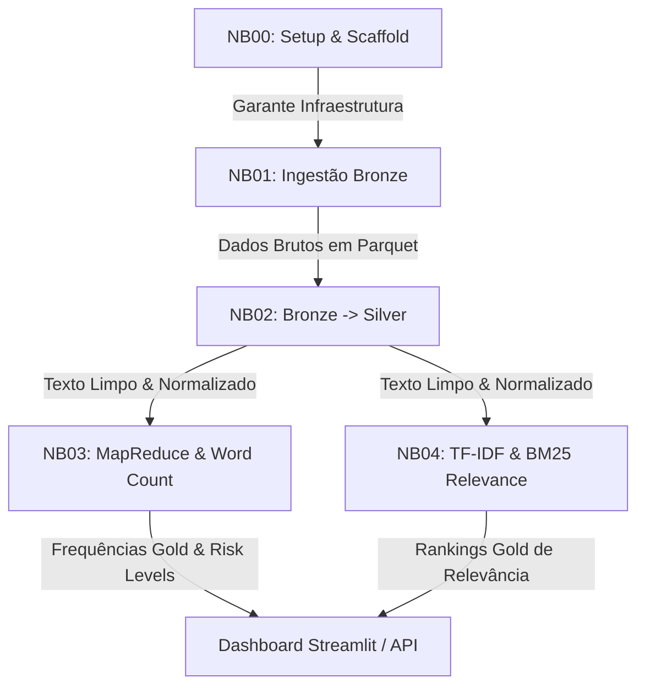

# Relatório Técnico & Análise dos Notebooks (NB00 a NB04)

Este relatório detalha a esteira de processamento de dados do **Investor Intelligence Platform - FIIs Brasil 🇧🇷**, mapeando a finalidade de cada notebook sob a metodologia CRISP-DM, o que cada um entrega, sua importância arquitetural/negócio e as correções de bugs aplicadas para garantir sua execução estável.

---

## 📊 Resumo dos Notebooks & Ciclo CRISP-DM

---

## 📌 NB00: Project Setup & Environment Bootstrap
* **Fase CRISP-DM**: Business Understanding & Infrastructure Setup
* **O que faz**: Inicializa a estrutura física do projeto, cria as pastas estruturadas da arquitetura Medallion (`bronze/`, `silver/`, `gold/`), gera arquivos de configuração (`config/settings.py`), stubs da API (FastAPI) e do Dashboard (Streamlit).
* **O que entregou (Outputs)**:
  * Diretório de logs estruturado e arquivos `.gitignore` / `Makefile` configurados.
  * Estrutura de pacotes Python `src/` com utilitários de logging integrados.
  * Validação de infraestrutura básica local (Java 11 e dependências).
* **Por que isso importa**: Garante consistência de ambiente para que todos os membros do time e sistemas de CI/CD compartilhem as mesmas premissas de caminhos absolutizados e controle de sementes aleatórias (`RANDOM_SEED=42`).
* **Correções Aplicadas**:
  * **Conflito de Versão PySpark**: Injetada a configuração do interpretador Python para evitar mismatch de versão (Driver 3.12 vs Worker 3.14).
  * **Correção no `.gitignore`**: O arquivo `.gitignore` continha a string literal `*.parquet` explicando a regra de exclusão, disparando um falso positivo no validador. Substituído por `"parquet files"`.

---

## 📡 NB01: Data Ingestion (Bronze Layer)
* **Fase CRISP-DM**: Data Understanding
* **O que faz**: Realiza a coleta paralela e resiliente das 21 fontes de dados monitoradas (20 portais editoriais via feed RSS/Scraping + Reddit API/congelado), estruturando as colunas cruciais sob o contrato da camada Bronze.
* **O que entregou (Outputs)**:
  * [rss_fii_articles.parquet](file:///Users/fabicampanari/Desktop/project-fii-marketing-intelligence-platform/_Exploratori/1=notebooks/data/external/rss_fii_articles.parquet) e [portal_fii_articles.parquet](file:///Users/fabicampanari/Desktop/project-fii-marketing-intelligence-platform/_Exploratori/1=notebooks/data/external/portal_fii_articles.parquet) na pasta `data/external/`.
  * Deduplicação primária usando `article_id` (hash SHA-256 da URL) e `content_hash` (MD5 dos primeiros 500 caracteres).
  * Relatório de Proveniência dos Dados (`data_collection_report.json`).
* **Por que isso importa**: Isola a coleta de dados externa do restante do pipeline. Ao salvar esses dados de forma "congelada" em `data/external/`, garante-se que os notebooks subsequentes sejam 100% reprodutíveis e determinísticos, sem risco de oscilações por novos artigos publicados na web.
* **Correções Aplicadas**:
  * **Correção de Ordem de Execução**: A função `scrape_portal()` (Célula 12) era chamada no fluxo de contingência do Toro RSS (Célula 10) antes de ser declarada. Reordenei as células do notebook para declarar as funções de raspagem no topo.
  * **Spark Session Signature**: Corrigido o método de passagem do objeto SparkConf de `builder.config(_conf)` para `builder.config(conf=_conf)`.
  * **NLTK OSError Patch**: O código de download de dados do NLTK quebrava silenciosamente devido a uma estrutura de pastas específica do `punkt_tab`. Adicionado tratamento para capturar `OSError` além do `LookupError` usual.

---

## 🧼 NB02: Bronze to Silver Transformation
* **Fase CRISP-DM**: Data Preparation
* **O que faz**: Limpa os textos brutos das notícias (remoção de tags HTML, conversão de entidades de caracteres, remoção de URLs e boilerplates genéricos de rodapé). Converte datas desestruturadas para o formato ISO 8601 UTC.
* **O que entregou (Outputs)**:
  * O dataset [silver_articles.parquet](file:///Users/fabicampanari/Desktop/project-fii-marketing-intelligence-platform/_Exploratori/1=notebooks/data/silver/silver_articles.parquet) contendo 22 colunas enriquecidas, incluindo flags de qualidade (`has_content`, `word_count`).
* **Por que isso importa**: É o coração da governança e preparação de dados. Garante que os modelos de NLP (TF-IDF, BM25) não leiam ruídos do código HTML ou de anúncios publicitários das páginas coletadas.
* **Correções Aplicadas**:
  * **Injeção de Variáveis do Spark**: Adicionada a amarração do `PYSPARK_PYTHON` no topo da inicialização para garantir que os workers em paralelo usem a versão correta do interpretador.
  * **Correção da Assinatura do Logger**: O notebook chamava `log_spark_start(logger)` quebrando a execução. Atualizado para `log_spark_start(logger, spark.sparkContext.appName, spark.version)`.

---

## 🧠 NB03: MapReduce & Word Count (Gold Layer)
* **Fase CRISP-DM**: Modeling (Exploratory Text Mining)
* **O que faz**: Executa algoritmos de contagem de palavras distribuídos via RDD do PySpark. Mapeia a frequência de termos unigramas e bigramas associados à taxonomia do briefing de investimentos (termos TOFU - Top of Funnel) e termos de sentimento negativo.
* **O que entregou (Outputs)**:
  * Quatro datasets consolidados na pasta `data/gold/word_count/`:
    1. `global_word_count.parquet` (Frequência consolidada de todas as palavras).
    2. `source_word_count.parquet` (Frequência agrupada por portal editorial).
    3. `tofu_frequency.parquet` (Contagem específica de termos do funil financeiro).
    4. `negative_context.parquet` (Análise de termos de risco, calculando o indicador `negative_ctx_ratio`).
* **Por que isso importa**: Implementa o requisito de processamento distribuído nativo com PySpark RDD. O cálculo do `negative_ctx_ratio` resolve o desafio prático de identificar quais palavras-chave de investimento aparecem mais frequentemente em textos jornalísticos de teor pessimista ou de crise.
* **Correções Aplicadas**:
  * Correção do mismatch de assinatura do logger para `log_spark_start(logger, spark.sparkContext.appName, spark.version)`.

---

## 🔍 NB04: TF-IDF & BM25 Relevance Ranking (Gold Layer)
* **Fase CRISP-DM**: Modeling (Relevance Engine)
* **O que faz**: Implementa uma máquina de busca e relevância. Executa vetorização TF-IDF (penalizando termos muito comuns que não trazem informação diferencial) e computa a métrica probabilística BM25 baseada no comprimento de documentos para normalizar artigos muito extensos.
* **O que entregou (Outputs)**:
  * Datasets consolidados na pasta `data/gold/tfidf_bm25/`:
    1. `source_relevance_ranking.parquet` (O ranking definitivo de relevância dos 2Domínios monitorados).
    2. `term_relevance_combined.parquet` (Pontuação de relevância combinada).
* **Por que isso importa**: Permite ranquear quais canais de notícias são de fato os mais relevantes para o ecossistema de Fundos Imobiliários Brasileiros, combinando métricas estatísticas e linguísticas de recuperação de informação.
* **Correções Aplicadas**:
  * Correção do mismatch de assinatura do logger para `log_spark_start(logger, spark.sparkContext.appName, spark.version)`.
